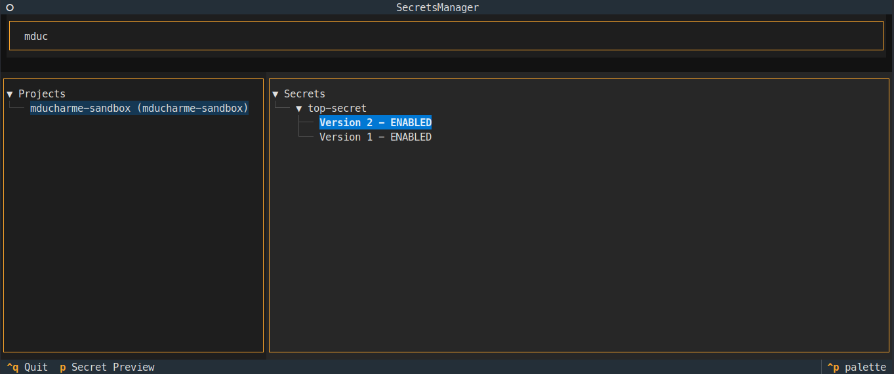

[](https://codecov.io/gh/mikaeld/secrets-manager)



# Secrets Manager

A Terminal User Interface (TUI) application for managing Google Cloud Platform secrets, built with Textual.

## Features

- 🔍 Search and browse GCP projects
- 📝 List secrets within selected projects
- 🏗️ Built with `uv` package manager

## Usage
This project uses `uv`. See their [documentation](https://github.com/astral-sh/uv/blob/main/README.md#installation) for installation instructions.

You must be authenticated with Google Cloud CLI. You can do this by running:

```bash
gcloud auth application-default login
```

Run the application with:
```bash
uv run app.py
```